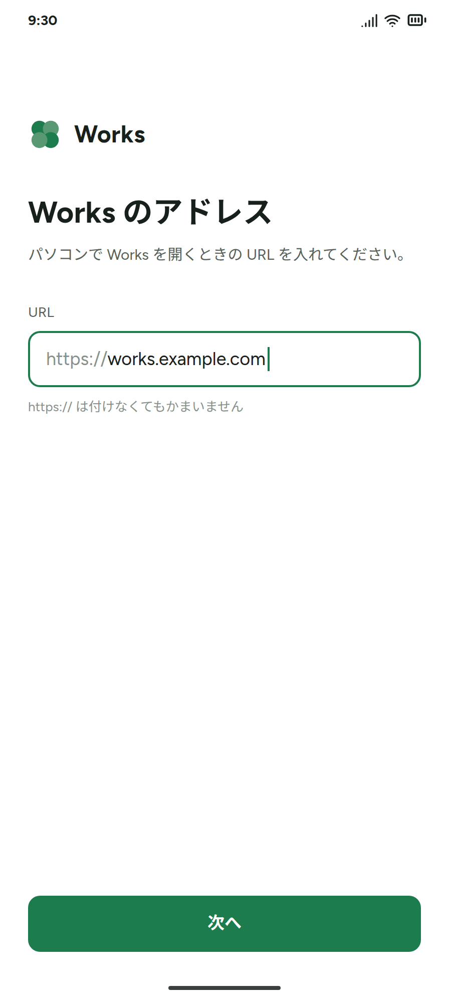
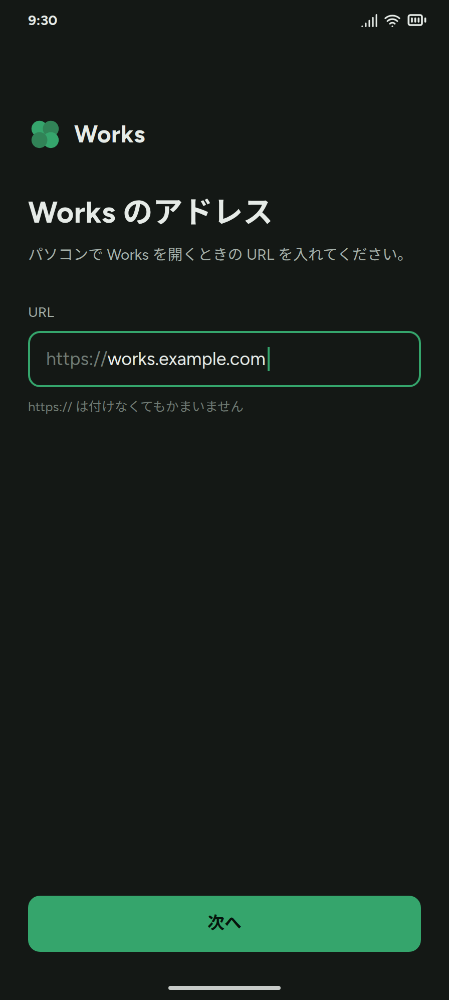
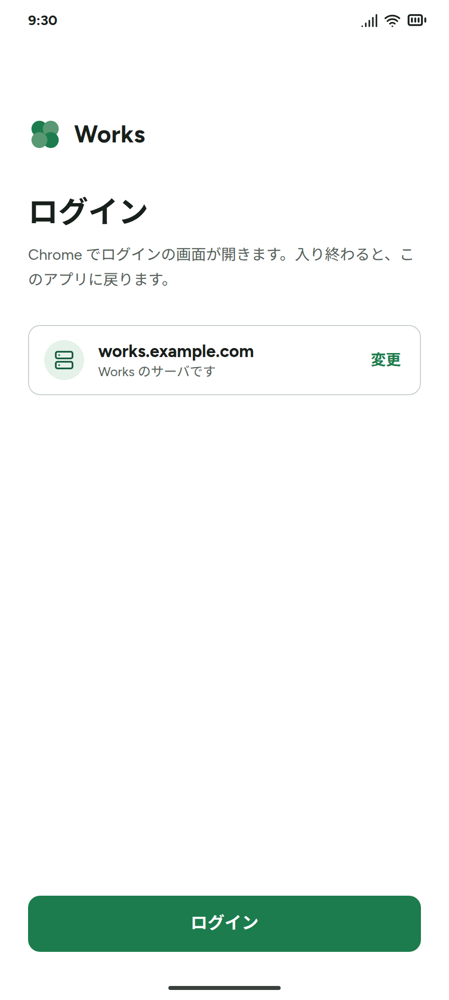
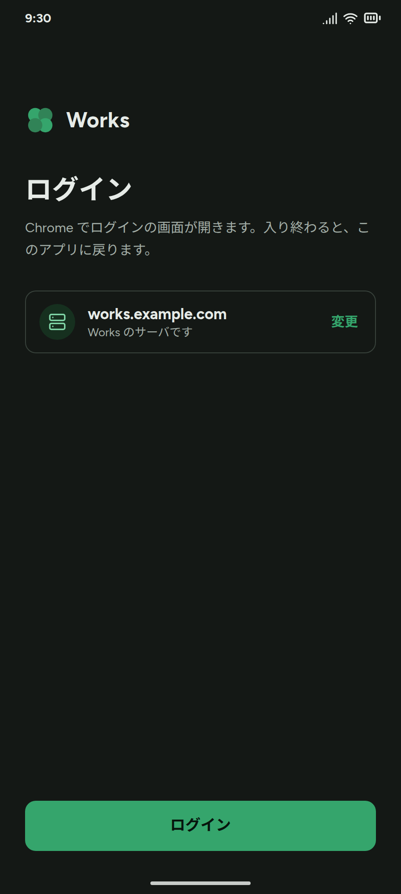
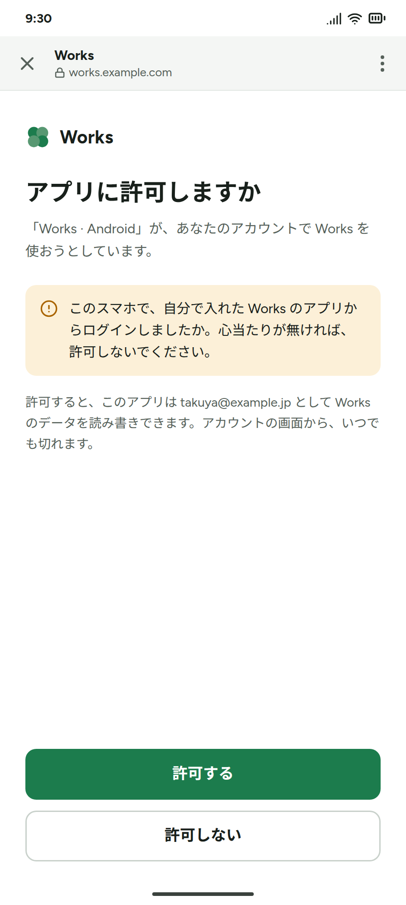
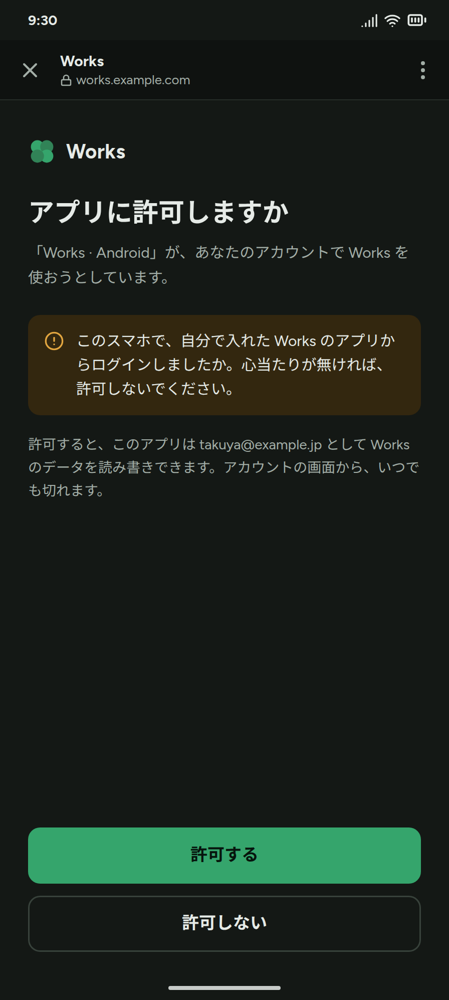
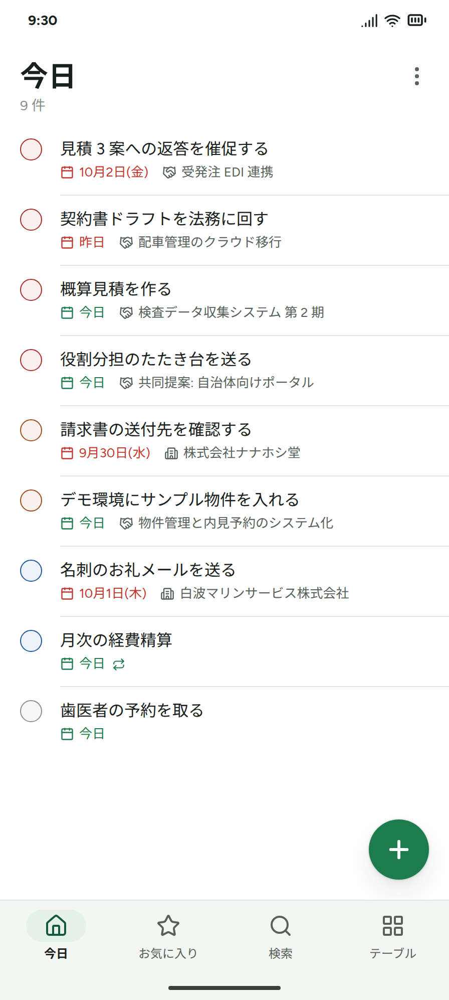
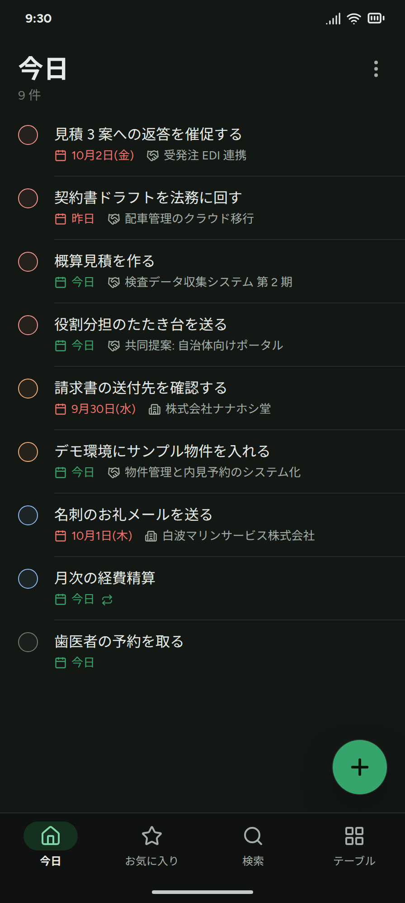
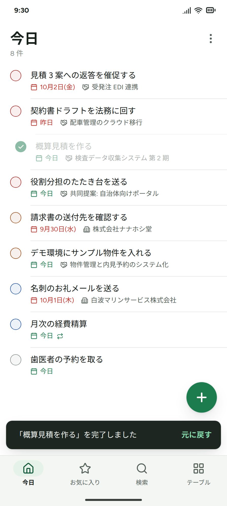
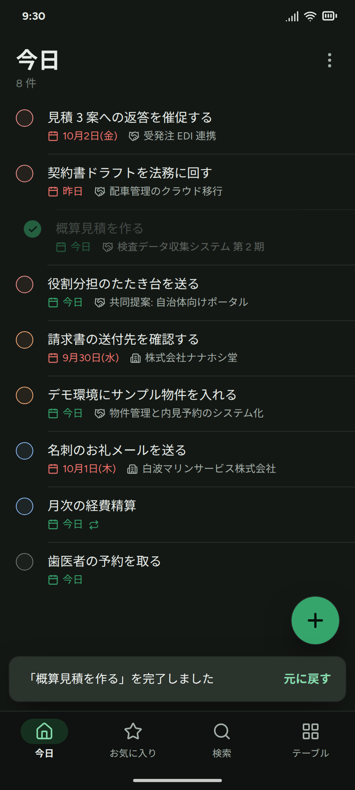

# 09 Android アプリ

Works の Android のネイティブアプリの、**決定と仕様をこの 1 枚にまとめる**(本人の要望。2026-10-01)。
**作るのは Codex**(2026-10-03、本人の決定。A-20)。この 1 枚を、Codex がこれだけ読めば迷わず作れる仕様書に仕上げる。
サーバ側の口は 04、ログインの仕組みは 03 §5、外から届く口は 06 §7(手前に門は置かない)。ここに書いていないことは Web と同じ(01〜05)。

状態(2026-10-04): 仕様の段階。コードはまだ無い(サーバの分は J-071、アプリの雛形は J-056)。決定は §2、本人の確認を待つものは §15。
2026-10-03 に、アプリを**どのサーバにも繋がる汎用のもの**にした(A-17〜A-19。§5・§6)。2026-10-04 に、**データの読み書きは必ずメタデータに基づく**と決めた(A-21。§5)。

## 1. 目的と性格

- 毎日の CRM の操作(今日のタスクを片付ける、取引先・商談を見て直す、やり取りを記録する)を、スマホから**サクサク**やるためのアプリ
- **命は速さ。**本人: 「基本サクサク動かないと使いたくなくなる」。操作感の手本は **Todoist の Android アプリ**(本人が何年も使い、完成度が高いと感じている)
- Web はスマホ幅でも全機能が使える(01 §4)。アプリは Web を置き換えるのではなく、毎日使う入口を速くするもの。環境設定は Web で行う
- 利用者は当面 1 名(本人の Android)。Play ストアには出さず、APK を直に入れる(§13)

## 2. 決定

| ID | 決定 | 理由 | 誰が・いつ |
|---|---|---|---|
| A-01 | **ネイティブ(Kotlin + Jetpack Compose)で作る。**Web を包む形(WebView・TWA)は採らない | 速さ(§3)。端末の機能(通知・ウィジェット・共有メニュー)も使える | 本人(2026-10-01) |
| A-02 | **範囲は Web の機能すべて(環境設定を除く)。違和感なく使える**こと。順は §14 の段階で | 本人の要望(Q-047 の答え) | 本人 |
| A-03 | **環境設定はアプリに持たない**(テーブル設定・Web フォーム・ワークフロー・Slack・MCP)。アカウント(パスワード・2 段階認証)も Web で | 本人の決定(「一旦しない」) | 本人 |
| A-04 | **メタデータ(テーブル・項目・ビュー・サイドバー)を手元に写しておき、起動はその写しで描く。**実データは、メタデータ(ビューの定義)どおりに問い合わせ、結果も写しておく(§7) | 本人の案。起動と切り替えを待たせない | 本人 |
| A-05 | **作る・直す・消す・元に戻すは Web と同じ**(楽観更新 + 「元に戻す」)。業務ルール(既定値・完了日時・繰り返しの次回・確度)はサーバ。アプリは計算しない | 本人の要望。CLAUDE.md の決まり(画面に同じ計算を持たせない) | 本人 |
| A-06 | **画面はメタデータで描く。**テーブル名・項目名をアプリのコードに書かない | 01 D-01。Web で足したテーブル・項目・ビューが、アプリを出し直さずに出る | — |
| A-07 | **門(Cloudflare Access)は置かない。アプリはサーバの URL に直に届く**(§5)。同じ日の前半は「端末に入れた Cloudflare One Agent(旧 WARP)で門を通る」だった | 本人の決定: 「Access を素通りにし、ログインやセッション管理は全面的にシステム側に。スマホアプリや AI エージェントからのリクエストも届くように」(01 D-14) | 本人(2026-10-01) |
| A-08 | **ログインは Works の OAuth(公開クライアント・PKCE)。**アプリは繋ぐサーバに自分を登録する(動的登録。A-17)。入ったあとは使い続ける限りログインし直さない(§6) | 03 §5。Todoist と同じく、毎日の起動でログインを見せない | — |
| A-09 | **書式付きの文字と @ の言及は、Web と同じ HTML の形で読み書きする**(§8) | 本人の要望(Web の機能を違和感なく)。サーバの洗浄と言及の写しをそのまま使える | 本人 |
| A-10 | **契約は 04 と `types.ts` が正。**Kotlin の型は写し、契約を変えたら同じコミットで `android/` も揃える | 03 §12 | — |
| A-11 | **見た目は Works のトークン(`index.css`)を写し、動きと操作は Todoist に寄せる** | Web と同じ見た目で、操作は本人が完成度が高いと感じている Todoist に | 本人 |
| A-12 | 置き場は `android/`、確かめは `scripts/verify-android.sh`(`verify.sh` には入れない)、決まりは `android/CLAUDE.md`(Codex も CLAUDE.md を読む設定にしてある) | 01 D-15、03 §12 | — |
| A-13 | **ログインの画面はブラウザ(Auth Tab で Works の `/login`)。**アプリの中にログインの画面は作らない(§6) | 2 段階認証・Google・パスワード管理が Web と同じ 1 枚で済み、アプリはパスワードに触れない | 本人(2026-10-01。Q-049) |
| A-14 | **アプリならではのもの(期限の通知・ホーム画面のウィジェット・共有メニューからの登録)を入れる。**段階 2 | 本人の要望(Todoist にある) | 本人(2026-10-01) |
| A-15 | **本人の実機での試しは本番に向ける。Codex の試しは手元のサーバに向ける**(§12)。新しい試しの場所は作らない(手元のサーバは Web の E2E がもう使っているもの) | 本人がリスクを承知で決めた(2026-10-01)。アプリを汎用にして手元のサーバにも繋がるようになったので、Codex の試しは本番に触れない形にした(2026-10-03) | 本人(2026-10-01。Q-051。2026-10-03 に改めた) |
| A-16 | **オフラインの書き込みを持つ(Todoist の形)。**圏外でもいつもどおり書け、電波が戻ったら溜めた分を送る。書き込みは初めから「送り箱」に積んで送る形で作り、段階 1 に入れる(§7) | 本人の決定(Q-050) | 本人(2026-10-01) |
| A-17 | **アプリは特定のサーバ・環境に依存しない(汎用)。**サーバの URL はアプリで入れ、ログインするとアプリがセッション(OAuth のトークン)を持つ。サーバにアプリを前もって登録しない(アプリが動的登録で自分を登録する)。サーバにアプリのための設定(パッケージ名・署名の指紋)を置かない。アプリのコードに特定の環境の値(URL・会社名・ドメイン)を書かない(§5・§6) | 本人: 「アプリ側でサーバの URL を指定し、ログインするとセッションを持つような形にしたい。あくまで私の環境に依存しない汎用性の確保のため」。前の案(サーバに `works-android` を入れ、https の戻り先を `assetlinks.json` で確かめる)は、サーバの `.env` にアプリのパッケージ名と署名の指紋を要し、戻り先も 1 つのドメインに縛られた | 本人(2026-10-03) |
| A-18 | **ログインのたびに許可のカードを出す。**2026-10-01 に了承をもらった「出さない」を改める(§6.2) | アプリ専用の形の戻り先(A-17 で https から替えた)は、ほかのアプリも名乗れる。サーバはアプリが本物か確かめられないので、毎回本人の許可を求める(RFC 8252 §8.6)。出るのはログインし直すときだけ | 本人(2026-10-03) |
| A-19 | **繋ぐ先は 1 か所ずつ。**切り替えはログアウトして入れ直す。写しはサーバ + 利用者ごとに分け、混ざらないようにする(複数を同時に持つのは、あとで足せる形に。§6.1) | 汎用にしても、使うのは当面 1 か所 | 本人(2026-10-03) |
| A-20 | **製造は Codex に任せる。**この 09 を、Codex がこれだけ読めば作れる仕様書にする | 本人の決定 | 本人(2026-10-03) |
| A-21 | **データの読み書きは、必ずメタデータに基づく。**アプリはテーブル名・項目名・選択肢の値・ビューの定義をコードに持たず、`GET /meta` から画面・入力・確かめ・書き込みを作る。メタデータで防げないずれのために、メタデータの版・知らないものの読み方・API の版・契約の見本を合わせて持つ(§5) | 本人: 「Android 側とサーバ側で IF が合わなくなる事は度々ある。必ずメタデータを取得し、それに基づくデータの CRUD を行うルールに」。アプリは端末に入れた版のまま使われ、サーバは別の時に新しくなる(ほかのサーバにも繋がる。A-17)ので、版のずれは前提 | 本人(2026-10-04) |
| A-22 | **サーバ側の変更は Claude が先に作って本番へ出す。Codex は `android/` に専念する**(J-071) | アプリはサーバの変更が無いとログインもできない。認証に触る。サーバの決まり事・テスト・本番へ出す段取りを Codex に覚えさせずに済む | 本人(2026-10-04。U-10) |
| A-23 | **見た目の正は、主な画面の絵(明・暗)。**Claude が Works のトークンで作り、この 1 枚に付ける | 命は見た目と軽快さ。文章だけだと、Codex は Android の標準の見た目に寄る。直すのも、作る前の絵のほうが安い | 本人(2026-10-04。U-6) |
| A-24 | **Codex に最初に渡すのは細い 1 本**: サーバの URL → ログイン → 今日のタスクが出る → ○ で完了 → 元に戻す。実機で速さ・見た目・写しと送り箱の土台を確かめてから、残りを渡す | 土台のまずさを、作り込む前に見つける | 本人(2026-10-04。U-7) |

## 3. 速さの作り(なぜネイティブか)

本人の問い「Web の UI も使えるが、アプリ側で別に UI を作ったほうが速い、という理解で合っているか」→ **合っている。**ただし、速さの本体は「手元にデータがあること」と「応答を待たないこと」で、ネイティブはその 2 つを作りやすい。

| | Web(ブラウザ・WebView) | ネイティブ |
|---|---|---|
| 起動 | 開くたびに JS(gzip で 120KB 程度)を読み、組み立ててから、データを取りに行って描く | 組み立て済みのコード。Baseline Profile で最初の起動の手間も省ける |
| データ | タブを閉じると手元の写しが消える。開くたびに取りに行く | 手元の DB に写しを持ち、**まず写しを描いてから**裏で取り直す |
| 動き | スクロールやスワイプはブラウザ任せ | 端末の描画で 60fps(120Hz の端末は 120)。触覚(振動)も使える |
| 端末の機能 | 限られる | 通知、ホーム画面のウィジェット、共有メニュー |

Web も楽観更新はしているが、起動のたびに写しの無いところから始まる。ネイティブは写しを持ち続けられる。

**目標(数字で守る。Macrobenchmark で起動とスクロールを測る):**

| 場面 | 目標 |
|---|---|
| 起動(写しあり)→ ホーム(今日)が出る | 1 秒以内(コールドスタート) |
| タブ・画面の切り替え | 写しがあれば即(100ms 以内に中身が出る) |
| 完了・作成・編集の反応 | 押した瞬間(楽観更新。100ms 以内) |
| スクロール | 落ちない(60fps、120Hz の端末は 120) |
| 検索 | 打つたびに 300ms 以内に候補(間引いてサーバへ) |

## 4. 画面(Todoist を手本に)

### 4.1 骨格

絵は §4.7(下はその骨組み)。

```
┌──────────────────────────────────┐
│ 今日                          ⋮   │  ビューの名前と件数。⋮ に並び・表示の切り替え
│ 9 件                              │
│ ○ 見積 3 案への返答を催促する      │  ○ の色は優先度。押すと完了(行が抜け、「元に戻す」)
│   [暦] 10月2日(金) [商談] 受発注 EDI │  2 行目にビューの列を 2 つまで(期限切れは赤、今日は緑)
│ ○ 概算見積を作る                  │
│   [暦] 今日 [商談] 検査データ収集…   │
│                              (+)  │  追加(どの画面にもある。Todoist の +。色はクローバーの緑)
├──────────────────────────────────┤
│  今日   お気に入り   検索   テーブル  │  下のナビ
└──────────────────────────────────┘
```

- **下のナビは 4 つ**: ホーム(お気に入りの先頭のビュー。名前はその `pin.label` で、本人の環境では「今日」)、お気に入り(`pin` のビュー。件数付き)、検索、テーブル(サイドバーのテーブルとフォルダ)。Todoist の「今日・近日予定・検索・ブラウズ」に当たる。どれもメタデータから作る
- **並びはビューの定義どおり。**Todoist の「期限切れ」「今日」の区切りは持たない(区切りはビューの定義に無い。A-21。要るなら、ビューの設定として足す)
- **行**: 1 行目に表示名(`name_field`)。2 行目に、ビューの列の順で 2 つまで(表示名の列と、チェックの色に使う優先度の列は除く)。型ごとの出し方: 日付は暦のアイコンと「今日・昨日・10月2日(金)」(締め切り `semantic: deadline` が過ぎていれば赤、今日なら緑)、参照は相手のテーブルのアイコン(メタデータの `icon`)と表示名、選択肢はタグ、利用者は名前。繰り返しのタスクは、日付のあとに繰り返しのアイコン
- **(+)** はどの画面にもあり、タスクを追加するシート(§4.4)
- **戻る**は Android の戻るジェスチャ。Web のぱんくずに当たる(画面の積み重ね)
- 明暗は端末の設定に従う

### 4.2 テーブルの画面

- 上にビューのタブ(一覧・カンバン・レポート。並びは Web と同じ)
- **一覧**: 1 行に表示名と、ビューの列の先頭のいくつか(画面の幅で数を決める)。押すと詳細、長押しでメニュー(開く・削除)
- **タスクの行**: 左の ○(優先度の色)を押すと完了。○ が塗られ、行が抜け、下に「元に戻す」(Todoist と同じ)。**右へスワイプで完了、左へスワイプで期限を変える**(Todoist の既定と同じ向き)
- **カンバン**: 列を横にめくる。カードは長押しで持ち上げ、ほかの列へ移す。列の見出しに合計
- **レポート**: 数字のタイルと棒グラフ。色は `dataviz` の検証を通した値(05 §4)
- 引っぱって取り直す(写しがあるので、引っぱらなくても待たせない)

### 4.3 詳細(Web のレコードのパネル)

- 全画面。上に表示名とテーブルのアイコン
- **項目**(メタデータの順): 押すとその場で直す。型ごとの入力 — 日付はカレンダー、選択肢は下からのシート、参照は検索して選ぶ、複数選択はチップ、書式付きの文字は §8 のエディタ
- その下に**タスク**(+ で、このレコードが関連先に入った追加)、**活動の時系列**(+ で記録)、**関連リスト**(メタデータから自動で出す。02 §3)
- **Google ドライブの項目**: ファイルの一覧(押すと Drive のアプリで開く)と、新規作成
- 削除は ⋯ から。「元に戻す」で戻る

### 4.4 タスクの追加(Web の `Q`)

- 下から出るシート。件名に「明日」「金曜」「9/30」「p1」「毎週」と書けば、期限・優先度・繰り返しとして読み、色の地を敷く(Web と同じ)
- 詳細から開くと、そのレコードが関連先に入る
- 読み取りの規則は Web(`frontend/src/lib/quickAddParser.ts`)を Kotlin に写す。**同じ見本(JSON)で Web と Android の両方を確かめ**、ずれないようにする

### 4.5 検索

- 横断検索(`GET /search`)。打つたびに間引いて問い合わせ、テーブルごとにまとめて出す。押すと詳細

### 4.6 アプリの設定

- 小さく持つ: 繋いでいるサーバ(URL)とログイン中の人、ログアウト(繋ぐ先を替えるときもここから。A-19)、「アカウントの設定は Web で」(ブラウザでそのサーバの `/account` を開く)、アプリの版

### 4.7 絵(見た目の正。A-23)

`scripts/android-mockups.mjs` が作る(`node scripts/android-mockups.mjs`。置き場は `docs/design/android/`)。色は Web のトークン(`frontend/src/styles/index.css`)をその場で読むので、Web と食い違わない。データはモックの架空のもの。大きさは 448×997dp(本人の端末。Android 17)。
**Codex はこの絵に合わせて作る。**絵は 1 つの場面を切り取ったものなので、動きや決まりは文(この 1 枚)が正。

| 画面 | 明 | 暗 | 要点 |
|---|---|---|---|
| サーバの URL(§6.1) |  |  | `https://` は欄の中に薄く出し、打たなくてよい。「次へ」は下に付き、キーボードが出ているあいだはそのすぐ上に上がる |
| ログイン(§6.2) |  |  | 確かめたサーバを出し、「変更」で URL の画面へ戻る。「ログイン」で Auth Tab を開く |
| 許可のカード(Chrome の中の Web の画面。作るのは J-071) |  |  | アプリの名前は自己申告なので、名前に頼らず心当たりを確かめる。許可すると何ができるか、どこで切れるかを添える |
| 今日(ホーム。§4.1) |  |  | 大きな見出しと件数。行は罫線だけで、カードにしない(05 §4) |
| 完了 → 元に戻す(§4.2) |  |  | ○ が緑に塗られてチェックが描かれ、行が右へ抜ける(0.2 秒)。スナックバーは 7 秒(Web と同じ)。(+) はスナックバーの上へ逃げる |

**見た目の決めごと**(Web の 05 §4 をアプリに写したもの)

- 色: Web のトークンをそのまま(明・暗)。端末の色(Material You の dynamic color)は使わない
- 文字: 欧文と数字は Figtree(アプリに同梱する。400 と 700 の 2 つ)、和文は端末の Noto Sans CJK(Android の標準)。太さは 400 と 700 だけ
- 大きさ(sp): 12(下のナビ)/ 13(行の 2 行目・補足)/ 14(件数)/ 15(説明の文)/ 16(行の表示名・本文)/ 17(ボタン)/ 26〜30(画面の名前・見出し)
- 形: ボタンと欄の角は 12dp、(+) は丸(60dp)、スナックバーは 12dp。行は罫線だけ(罫線は ○ の右から引く)
- 大胆さは 1 か所に: 完了の ○(塗り・チェックの描画・行が抜ける動き。05 §4 と同じ)。ほかの動きは、開く・閉じる・差し込むだけで、どれも 0.2 秒以内
- 端から端まで描く(edge-to-edge)。下のナビの地は、ジェスチャの帯の下まで伸ばす

## 5. どのサーバ・どの版とも繋がる・門を置かない

### どのサーバにも繋がる(2026-10-03。A-17)

**アプリは特定のサーバ・環境に依存しない**(本人の決定: 「あくまで私の環境に依存しない汎用性の確保のため」)。だれでも自分のアプリの ID と鍵でビルドし、どの Works のサーバにも繋げる。

- **サーバの URL はアプリで入れる**(§6.1)。アプリは、繋ぐサーバに動的登録で自分を登録する(§6.2)。サーバに前もってアプリを入れない
- **サーバにアプリのための設定を置かない**(パッケージ名・署名の指紋・`assetlinks.json` は持たない)
- **アプリのコードに特定の環境の値を書かない**(サーバの URL・会社名・ドメイン)。アプリの ID と署名鍵はビルドの設定(§11)
- 画面はメタデータで描く(A-06)。テーブル名・項目名を持たない
- 「今日」などの日付は、サーバの時刻帯(`GET /meta` の `workspace.timezone`)で決める。端末の時刻帯は使わない
- サーバの設定しだいで使えるかが変わる機能(Google ドライブなど)は、`GET /api/v1/info` の `features` で出し分ける(04 §13)
- 外のサービスに頼らない。期限の通知は端末の中で予約する(Firebase のプッシュは使わない。使うと、配る人ごとに Firebase の設定が要る)
- 文言は日本語だけ。ただし `strings.xml` に集め、あとで訳せる形にする
- 手元のサーバにも繋がるので、Codex は本番に触れずに通しで試せる(§12)

### メタデータに基づき、版がずれても壊れない(2026-10-04。A-21)

アプリは端末に入れた版のまま使われ、サーバは別の時に新しくなる(ほかのサーバにも繋がる。A-17)。**アプリとサーバの版は、ずれているのが前提。**
本人の提案「必ずメタデータを取得し、それに基づくデータの CRUD を行う」を決まりにし(1)、メタデータで防げないずれのために 4 つを足す(2〜5)。メタデータで防げるのは、いちばん多い変化(テーブル・項目・選択肢・ビューの追加と変更)。防げないのは、メタデータが古いとき、アプリが知らない型や仕組みが増えたとき、API の形そのものが変わったとき。

**1. メタデータが正**

- アプリはテーブル名・項目名(列名)・選択肢の値・ビューの定義をコードに持たない。一覧・詳細・入力欄・新規作成の項目・並び・条件・関連リスト・時系列・完了の仕組みは、すべて `GET /meta` から作る
- 書くときは、メタデータにある書ける項目(`readonly` でない)だけを送る。入力の確かめ(必須・桁数・選択肢・参照先)もメタデータから先に行う(最後の判断はサーバ。A-05)
- 業務の役割は、名前でなく印で見つける: 完了できるテーブルは `completion`、時系列は `timeline`、締め切りは `semantic: deadline`、表示名は `name_field`、添え書きは `subtitle_field`、作成の欄は `in_create_form`
- Web には名前の決め打ちが残っている(タスクの追加が `priority`・`contact_id`・`contacts` を名前で探す、関連リストが `contacts` の `title` を添える、完了の ○ の色が `priority` を名前で探す)。**アプリはこれを真似しない。**代わりにメタデータへ印を足し、Web も同じ印を読むように直す(J-071)

**2. メタデータの鮮度(毎回は取りに行かない)**

- 書く前に毎回 `GET /meta` を取ると遅く(§3 の目標に反する)、圏外では使えない。代わりに、**サーバは `/api/v1` のすべての応答に、メタデータの版をヘッダ `Works-Meta-Version` で添える**(テーブル・項目・ビュー・サイドバーが変わるたびに変わる。J-071)。アプリは手元の写しの版と違えば `GET /meta` を取り直して描き直す。`GET /meta` は `ETag` を返し、変わっていなければ 304
- 書き込みが「定義に無い項目」「選択肢に無い値」などで断られたら(400)、メタデータを取り直してから「送れなかった変更」として扱う(§7)

**3. 知らないものに出会っても壊れない**

| 出会うもの | アプリの扱い |
|---|---|
| 応答の知らないキー | 無視する |
| 知らない項目の型(いまは 18 の型。02 §2) | 読むだけで文字として出し、アプリでは直せない(「Web で直せます」)。書き込みに含めない |
| 知らないビューの種類(いまは一覧・カンバン・レポート) | タブには出し、中身は「Web で開く」だけ |
| 知らない条件の演算子・マクロ | 端末で判定しない(そのビューは、サーバの問い合わせの結果だけで出す) |
| 知らない印(`semantic` の値など) | 無視する |
| 知らないエラーの `code` | サーバの `message` をそのまま出す(人が読める文。04 §1) |

**4. API の形は版で守る**

- `/api/v1` は**足すだけ**で変える(キー・口・任意の引数を足す)。名前を変える・消す・意味を変えるときは、`GET /api/v1/info` の `api_version` を上げる(04 §1・§13)
- アプリは繋ぐときと起動のたびに `GET /api/v1/info` を読む。扱えない版なら「アプリを新しくしてください」(サーバのほうが古ければ「サーバを新しくしてください」)と出し、送り箱は残したまま送るのを止める
- サーバの設定や版で変わる機能は、`features` で出し分ける

**5. 契約の見本で、ずれを機械で見つける**

- 手元のサーバの実際の応答(`/meta`・一覧・1 件・時系列・集計・エラー)を、見本の JSON として `contracts/` に置く。サーバのテストが作り直すので、形が変われば差分に出る(J-071)
- Android の単体テストは、この見本を Kotlin の型で読めることを確かめる。Web の型(`types.ts`)と Kotlin の型を人が写す(A-10)だけに頼らない
- Web と Android で同じ規則を持つもの(タスクの追加の読み取り §4.4、条件の判定、書式付きの文字の洗い方 §8)の見本も、同じ `contracts/` に置き、両方のテストで読む

### 門を置かない(2026-10-01)

Works は手前に門(Cloudflare Access)を置かない(本人の決定。01 D-14 の 2 度目の見直し、06 §3)。
アプリはサーバの URL(本人の環境では公開 URL)に直に届き、Works の OAuth(§6)だけで「誰か」を示す。端末に入れるもの(WARP など)も、アプリが持つ門の鍵も無い。

### 記録: Cloudflare One Agent(旧 WARP)で門を通す案(同じ日の前半)

門を残すと決めていたあいだの案。Access を外すと決めて、使わなくなった(J-057 は取り下げ)。門をまた置くときのために、確かめたことだけを残す(一次資料は 03 §13)。

- 費用: Zero Trust の Free プランは 50 人まで $0。端末用アプリは Play ストアの「Cloudflare One Agent」(一般向けの 1.1.1.1 + WARP は Zero Trust に使えない)
- Access のログインを省くには「Authenticate with Cloudflare One Client」(**ベータ**。最大 90 日)。通すのを Works だけにするなら Split Tunnels の Include
- 実機で確かめるまで決めきれなかったこと: アプリ(OkHttp)の通信がログインの画面なしで門を通るか(公開ホスト名の Access アプリについて資料に無い)、ベータの機能が Free で使えるか、Android は VPN を同時に 1 本しか使えないこと
- 通らなかったときの代わり: Access の Managed OAuth(2026-03 に追加)か、端末ごとの Access のサービストークン

## 6. サーバの URL・ログイン・セッション

### 6.1 サーバの URL(A-17・A-19)

- 初めて開くと、サーバの URL の欄と「次へ」だけの画面が出る。`works.example.com` と打てば `https://` を補う。受けるのは https だけ(開発用の版だけ http も受ける。手元のサーバとエミュレータで試すため。§12)
- 「次へ」で `GET <URL>/api/v1/info`(ログイン無しで読める。04 §13)を読んで確かめる。Works のサーバでなければ「Works のサーバではありません」、`api_version` が合わなければ「アプリを新しくしてください」か「サーバを新しくしてください」を出して止まる。通れば「ログイン」(§6.2)
- 繋ぐ先は 1 か所ずつ。アプリの設定(§4.6)に、繋いでいるサーバとログイン中の人を出す。繋ぐ先を替えるときは、ログアウトして URL から入れ直す
- 写し(§7)はサーバ + 利用者ごとに分ける(端末の DB のファイルを分ける)。ログアウトで、その写しを消す
- サーバはホストの直下に置かれている前提(`https://example.com/works/` のような下の階層は扱わない。OAuth の口を知る `/.well-known/oauth-authorization-server` がホストの直下にあるため)

### 6.2 ログイン

本人の問い「2 段階認証を入れているが、アプリからの要求でログインし、セッションを得られるか」→ **得られる。**形は 2 通りあり、**本人はブラウザ(Auth Tab)で Works のログインの画面を開く①を選んだ**(2026-10-01。A-13)。

| | ① ブラウザ(Auth Tab)で `/login`(採用) | ② アプリの画面でログイン(採らない) |
|---|---|---|
| 見た目 | アプリの上に Chrome のシートが開き、Works のログインの画面が出る。入ると自動でアプリへ戻る | アプリの画面にメールアドレス・パスワード・6 桁の欄 |
| 2 段階認証・Google | Web と同じ画面がそのまま使える | アプリに 6 桁の画面を作る。Google は Credential Manager と、GCP に Android 用の OAuth クライアントが要る |
| パスワードの扱い | アプリは触れない(漏れる面が増えない) | アプリが受けてサーバへ送る |
| パスワード管理 | Google パスワードマネージャーがそのまま効く | アプリの欄でも効く(自動入力) |
| サーバ | 今ある OAuth の口(MCP 用)を使う。アプリは繋ぐサーバに自分を動的登録する(サーバに前もって入れない。A-17。アプリ専用の形の戻り先を受けるのは J-071) | アプリ専用のログインの口を足す。OAuth 2.1 は「パスワードを直接受ける形」を外していて、標準から外れる |
| 決まり | RFC 8252(ネイティブアプリの OAuth)どおり | — |

**流れ**(どのサーバでも同じ。A-17):

1. `GET <URL>/.well-known/oauth-authorization-server`(RFC 8414)で口の場所(`authorization_endpoint`・`token_endpoint`・`registration_endpoint`・`revocation_endpoint`)を知る
2. `POST /register`(動的登録。RFC 7591)で自分を登録し、`client_id` をもらう。本文は `client_name`(`Works · Android`)、`redirect_uris`(`["<アプリの ID>:/oauth/callback"]`)、`grant_types`(`authorization_code`・`refresh_token`)、`token_endpoint_auth_method: "none"`(公開クライアント)、`scope: "api"`。**ログインを始めるたびに登録し直す**(前の `client_id` を使い回さない。サーバは許可の付いていない登録を片付けるので、使い回すと、片付けられたあとに `/authorize` がブラウザの中で失敗する)
3. Auth Tab で `/authorize` を開く(`response_type=code`、PKCE の S256、`state`、`scope=api`、`redirect_uri`)。Works のログインの画面(パスワード + 6 桁 / Google / Microsoft + 6 桁)→ **許可のカード**(A-18)
4. 許可すると、サーバが `<アプリの ID>:/oauth/callback?code=…&state=…` へ戻す。Auth Tab は結果を、開いたアプリに直に返す(intent-filter は要らない)。Auth Tab の無いブラウザでは Custom Tabs に落ちるので、そのための intent-filter(アプリの ID のスキーム)も持つ。`state` が違えば捨てる
5. `POST /token`(コード + PKCE の検証値)→ access token(1 時間)+ refresh token(90 日)
6. 以後は `Authorization: Bearer <access token>` で `/api/v1` を呼ぶ。401 なら refresh で取り直して 1 回だけやり直す。refresh も断られたら(`invalid_grant`)ログインの画面へ戻す。写しと送り箱は残し、同じサーバに同じ人で入り直したら続けて使う

- **戻り先はアプリ専用の形**(RFC 8252 §7.1 の private-use URI scheme): スキームはアプリの ID(ビルドする人が持つドメインを逆向きにしたもの。ドットを含む。§11)、`:/` のあとはスラッシュ 1 本。RFC 8252 は、OS が許すなら https の戻り先を勧める(§7.2)が、どのサーバにも繋がるアプリでは使えない(Android でアプリが https の URL を受けるには、そのドメインをビルドのときに書き、サーバ側にもアプリの指紋を置く。A-17 に反する)
- **許可のカード**(A-18): アプリ専用の形のスキームは、ほかのアプリも名乗れる。サーバはアプリが本物か確かめられないので、前に許可した `client_id` でも毎回許可を求める(RFC 8252 §8.6)。カードの文はアプリ向け(05 §15)。出るのはログインし直すときだけ(初回、90 日使わなかったとき、切られたとき)
- 守りの重ね: PKCE(コードを横取りされても替えられない)、Auth Tab が開いたアプリに直に返すこと、許可のカード、Works のログイン(2 段階認証)。戻り先がアプリ専用の形なので、コードは本人の端末の中にしか戻らない(よその Web サイトへは渡らない)
- ログインは**初回と、90 日使わなかったときだけ**。refresh token は使うたびに新しいものに替わるので、使い続ける限りログインし直さない(Todoist と同じく、毎日の起動では出ない)

### 6.3 セッション

- アプリの「セッション」は OAuth のトークン(access 1 時間、refresh 90 日)と、それを出した登録の `client_id`(refresh と `/revoke` に要る)。refresh token は Android Keystore の鍵で暗号化して置く(`EncryptedSharedPreferences` は非推奨なので使わない)。refresh は同時に 1 本だけ走らせる(2 本走ると後の 1 本が `invalid_grant` になり、ログアウトしたように見える。03 §5)
- アカウントの画面(Web)の「ログイン中の端末とアプリ」に出て、そこから切れる。パスワードを変えると切れる
- ログアウトは `/revoke` で許可ごと消し、そのサーバ・その人の写しを消す(送っていない変更があれば、先にその旨を知らせる。§7)
- 門は無い(§5)ので、Works のログインと、そこから出た OAuth のトークンだけが守り。端末を無くしたら、アカウントの画面(Web)でその端末の許可を切る

## 7. データの写しと同期(オフラインの書き込みを持つ。A-16)

Todoist と同じく、**圏外でもいつもどおり読み書きでき、電波が戻ったら溜めた分を送る**(本人の決定)。

**写し(端末の DB。Room)**

- 写しはサーバ + 利用者ごとに分ける(DB のファイルを分ける。§6.1・A-19)
- メタデータ: `GET /meta` の応答をそのまま(JSON)。起動時は写しで描き、裏で取り直して、変わっていれば差し替える
- レコード: 1 行 = テーブル名・ID・JSON。列はメタデータで増えるので、表の形(列)にしない。**まだ送れていない変更も、写しに当てた状態で持つ**
- 問い合わせの結果: ビューと条件ごとの ID の並び(Web の TanStack Query のキャッシュに当たる)
- 取り直す時: 画面を開いたとき(写しを出してから)、アプリが前面に戻ったとき、電波が戻ったとき、引っぱったとき。**取り直すのは差分だけ**(`updated_since`。消したものも返してもらい、写しから外す。J-062)

**書き込み(送り箱に積んで送る)**

- 書き込みは 1 件ずつ「送り箱」(アウトボックス。端末の DB の表)に積み、写しにはすぐ当てる(楽観更新)。送り係(WorkManager)が積んだ順に送る。電波があればすぐ送るので、ふだんは Web と同じ速さで反映される
- **新しいレコードの ID はアプリが決める**(UUID v7)。圏外で作ったタスクに、続けて活動を付けられる。サーバはアプリが決めた ID で作り、**同じ ID が 2 回届いても 1 件だけ作る**(送り直しで二重にならない)。消す・戻すの送り直しも同じ結果になるようにする
- 送る順: 積んだ順。同じレコードへの書き込みはこの順のまま届き、作成が必ず先に届く
- 直すのは変えた項目だけ(`PATCH`)。圏外のあいだにパソコンで別の項目を直していても、両方が残る
- **衝突**(同じ項目を、アプリとパソコンの両方で直した): 後からサーバに届いたほうが残る(項目ごと)。どちらが残ったかは、取り直した写しで見える
- **あとで断られた**(必須の項目が空、参照先が消えていた、相手のレコードが消されていた): その書き込みを写しから外して元に戻し、「送れなかった変更」として知らせる(通知と、アプリの中の一覧)。直して送り直すか、捨てるかを選べる
- **繰り返しのタスク**: 完了で次回を作るのはサーバなので、圏外のあいだは次回が出ない。電波が戻って送ると出る
- **「元に戻す」**: まだ送っていなければ送り箱から外す。送ったあとなら、取り消しの書き込み(戻す・復元)を積む
- 送っていない変更があるうちにログアウトするときは、その旨を知らせてから消す
- 画面の上の端に、圏外であることと、送っていない件数を小さく出す

**サーバに要る変更**(J-061・J-062): 作成でアプリが決めた ID を受け、同じ ID なら既にある 1 件を返す。消す・戻すの送り直しで同じ結果を返す。差分の取得(`updated_since`)と `ETag`・304。いまの契約では作成の本文に `id` を入れると 400(04 §11)なので、04・`types.ts`・モック・`http.ts` を同じコミットで変える。Web は送り箱を持たない(いままでどおり)。

## 8. 書式付きの文字と @ の言及

- **保存の形は Web と同じ HTML。**許す要素は Web(`frontend/src/lib/richtext.ts`)と同じ: `p`・`br`・`strong`/`b`・`em`/`i`・`u`・`s`・`ul`・`ol`・`li`・`h1`〜`h3`・`blockquote`・`code`・`pre`・`a[href]`、言及の `span`(`data-type="mention" data-id="テーブル名:ID"`)。サーバが保存の前に洗い、言及を `mentions` に写す(02 §3)。アプリは同じ形で読み書きするだけ
- **表示**: HTML を Compose の書式付きの文字に変える、小さな変換を持つ(Web と同じ許可リスト)。言及は色付きで、押すとそのレコードを開く
- **編集**: 条件は、Web で書いたものを崩さずに読み、直して、同じ形で戻せること。材料と案は §10 の末尾(§15 の U-5)
- **@ の候補**: `@` を打つと、横断検索の候補をシートで出し、選ぶと言及を差し込む(Web と同じ)
- **時系列**(活動 + 言及 + 完了したタスク)はサーバが合わせる(04 §9)。アプリはそのまま出す

## 9. Web の機能との対応

**環境設定を除いて、漏れなく持つ**(A-02)。段階は §14。

| Web | アプリ | 段階 |
|---|---|---|
| サイドバー(お気に入り・テーブル・フォルダ) | 下のナビ(ホーム・お気に入り・検索・テーブル) | 1 |
| 一覧ビュー | 一覧(列は先頭のいくつか) | 1 |
| ビューのフィルター・並び | ビューの定義どおりに出す | 1 |
| 文字の絞り込み | 一覧の上の検索欄 | 1 |
| レコードのパネル・ぱんくず | 詳細の画面・戻るジェスチャ | 1 |
| 項目の編集(型ごと) | 型ごとの入力 | 1 |
| 関連リスト | 詳細の下 | 1 |
| 活動の時系列・記録・@ の言及 | 詳細の下・記録のシート・同じ言及 | 1 |
| タスクの追加(`Q`・読み取り) | (+)のシート(同じ読み取り) | 1 |
| 完了と「元に戻す」、繰り返し、ラベル | ○ と右スワイプ・スナックバー、サーバのまま、チップ | 1 |
| 横断検索(`/`) | 検索のタブ | 1 |
| レコードの作成・削除と「元に戻す」 | (+)・⋯・スナックバー | 1 |
| ログイン・ログアウト | Auth Tab(§6)・アプリの設定 | 1 |
| カンバン | 横にめくる列、長押しで移す | 2 |
| レポート | 数字のタイルと棒グラフ | 2 |
| Google ドライブの項目 | 一覧・Drive のアプリで開く・新規作成 | 2 |
| ビューの作成・編集(列・フィルター・並び・お気に入り) | 段階 3 で(それまでは Web で) | 3 |
| 一覧の列の幅・パネルの幅 | 持たない(スマホの画面に合わせて描く) | — |
| キーボード操作 | 物理キーボードの基本だけ | 3 |
| CSV の取り込みと書き出し | 持たない(Web で) | — |
| テーブル設定・環境設定・アカウント | 持たない(A-03。Web で) | — |

**アプリならではのもの**(Todoist にあり、Web には無い。**入れる。段階 2。**A-14): 期限の通知(端末の中で予約するので、サーバも Firebase も要らない。§5)、ホーム画面のウィジェット(今日のタスク)、共有メニューからの登録(URL や文字から活動・タスクを作る)。

## 10. 技術(2026-10-01 に一次資料で確かめた。採るときに版を引き直す)

共通ルール(非推奨のものを使わない)に従い、公式のリリースノートと Maven の版を直に引いた。**公式の手引きの中のコード例には古い版が多い**(Hilt の手引き、Auth Tab の手引きなど)ので、版はリリースノートで確かめる。

| 用途 | 採るもの | 版 | 確かめたこと |
|---|---|---|---|
| 言語 | Kotlin | 2.4.20(2026-09-07) | 2.5.0 は 2026-12 の予定 |
| 画面 | Jetpack Compose(BOM) | 2026.09.00(UI 1.12.1) | Compose 1.12 は compileSdk 37 が要る |
| 部品 | Material 3 | 1.4.0 | **Expressive は安定版に無い**(1.5.0-alpha)ので使わない。`material-icons` は更新が止まり、推奨外 → アイコンは Web と同じ lucide を、使う分だけベクターで持つ(メタデータの `icon` は lucide の名前) |
| 画面の移り | **Navigation 3** | 1.2.0(2026-09-23) | 従来の navigation-compose は maintenance mode(重大な修正だけ)。公式ブログが Navigation 3 への移行を勧める |
| 端末の DB(写し) | **Room 3**(`androidx.room3`) | 3.0.3(2026-09-09) | 公式の手引きも room3。KSP が要る |
| 小さな設定 | DataStore | 1.2.1 | SharedPreferences は新しい用途に使わないよう、強く勧められている |
| トークンの保存 | Android Keystore(AES-GCM)+ DataStore | — | `security-crypto`(EncryptedSharedPreferences)は全 API が非推奨 |
| 依存の組み立て | Hilt | 2.60.1(androidx.hilt 1.4.0) | Jetpack の推奨。minSdk 23 |
| 通信 | OkHttp | 5.5.0 | Web の `http.ts` と同じく、薄い窓口を自前で書く(Retrofit は使わない。要らないうえ、最後の版が 2025-05) |
| JSON | kotlinx.serialization | 1.11.0 | |
| 裏の処理 | WorkManager | 2.12.0 | minSdk 24 |
| ログイン | androidx.browser(Auth Tab) | 1.10.0 | Auth Tab は 1.9.0 から安定版。Chrome 137 以降。無い端末では Custom Tabs に落ちる。戻り先がアプリ専用の形(§6.2)なら intent-filter は要らず、結果は開いたアプリに直に返る(2026-10-03 に手引きで確かめた) |
| 起動の速さ | Baseline Profile + profileinstaller | benchmark 1.5.0・profileinstaller 1.4.1 | 初回の起動から約 30% 速い(公式)。**Play の外で配っても、profileinstaller が初回の起動で入れる** |
| 速さの計測 | Macrobenchmark | 1.5.0 | §3 の目標を測る |
| ビルド | Android Gradle Plugin 9.4.1・Gradle 9.6 以上・JDK 17 | | AGP 9.4 は API 37 まで |
| 対象の版 | compileSdk・targetSdk 37(Android 17。2026-06-16 公開)、**minSdk 29(Android 10)** | | 2026-10-04 に決めた(U-8)。本人の端末は Android 17(37)。29 にしたのは、ログインに使う Chrome が Chrome 139(2025-08)から Android 10 以上でしか更新されないため(それより古い版では、更新の止まったブラウザでログインすることになる)。端末の明暗の設定も Android 10 から。どのサーバ・どの端末にも使えるよう(A-17)、理由が出るまでは上げない |
| SDK を入れる | Android CLI(`android sdk`) | 1.0.16457483 | `sdkmanager` は非推奨(共通ルールの表)。利用状況を送るので `--no-metrics` を付ける |

採らないもの: navigation-compose(maintenance mode)、Material 3 Expressive(アルファ)、`material-icons`(更新停止)、`security-crypto`(非推奨)、AppAuth-Android(最後の版が 2021-12)、旧 Google Sign-In for Android(2026-08 に SDK から削除)。

ネイティブの Google ログイン(§6 の②を選んだときだけ要る): Credential Manager(`androidx.credentials`)1.6.0 と `googleid` 1.2.1。

**書式付きの文字のエディタ**(U-5)の材料:

- androidx に、書式付きの文字のエディタは無い
- Compose 1.12(2026-08)で、入力欄に書式を付ける API が入った(`TextFieldBuffer.addStyle`・`TextFieldState.textStyles`)。表示用の `AnnotatedString.fromHtml` は 1.7.0 からある
- コミュニティの `compose-rich-editor`(Apache-2.0。1.2.1、2026-09-30)は、HTML の読み書き(`setHtml`・`toHtml`)と @ の言及に対応する。ただし言及は実験的(`@ExperimentalRichTextApi`)で、HTML の形(`data-trigger="mention"`)が Web(`data-type="mention" data-id="テーブル名:ID"`)と違う
- 案: Compose 1.12 の書式の API と、Web と同じ許可リストの HTML の変換を自前で持つ(言及の形を Web と完全に揃えられ、実験的な API に寄りかからない)。手間が大きければ compose-rich-editor に変換の層を挟む

出典: kotlinlang.org/docs/releases.html、developer.android.com の各リリースノート(compose-bom・compose-material3・navigation3・navigation・room3・datastore・security・work・browser・benchmark・gradle-plugin)、developer.android.com/training/dependency-injection、developer.android.com/topic/performance/baselineprofiles/overview、developer.android.com/tools/sdkmanager・tools/agents、github.com/square/okhttp(lysine-dev へ移った)、github.com/Kotlin/kotlinx.serialization、github.com/MohamedRejeb/compose-rich-editor、developer.chrome.com/docs/android/custom-tabs/guide-auth-tab(すべて 2026-10-01 に取得)

## 11. 作り

- `android/` は Gradle のプロジェクト。始めは 1 つのモジュールで、中を層に分ける: `data`(API の口・端末の DB・写しと同期)、`ui`(画面。Compose)、`common`(書式付きの文字の変換、タスクの読み取り、トークン)
- API の型(04)は Kotlin に写す。メタデータの型はクラスに、レコードは列が増えるので JSON のまま(`JsonObject`)扱う。列名は snake_case のまま(Web と同じく、DB の 1 行の形を変えない)
- 秘密(署名鍵・`local.properties`)はリポジトリに入れない
- **アプリの ID(`applicationId`)と署名鍵はビルドの設定で決める**(リポジトリの外。`local.properties` か環境変数)。ID は、ビルドする人が持つドメインを逆向きにしたもの(RFC 8252 §7.1。ログインの戻り先のスキームになる。§6.2)。コードに会社名・ドメイン・サーバの URL を書かない(A-17)
- 文言は `strings.xml` に集める(日本語だけ。あとで訳せる形。§5)

## 12. 確かめ方

- **単体(JVM)**: API の型の読み書き、書式付きの文字の変換、タスクの読み取り(Web と同じ見本の JSON)
- **画面**: Compose の UI テスト(実機)
- **速さ**: Macrobenchmark(起動・スクロール)。§3 の目標を数字で守る
- **Codex の通しの試しは手元のサーバに向ける**(A-15)。WSL の Docker で動く API と PostgreSQL(`scripts/e2e-http.sh` が作り直す `works_e2e`。Web の E2E と同じ)に、エミュレータから繋ぐ。エミュレータからは `adb reverse` で手元のポートを繋ぎ、`http://localhost:<ポート>` で入る(サーバの公開 URL の設定と、アプリが入れる URL を揃えるため)。本番には触れない
- **本人の実機での試しは本番に向ける**(本人がリスクを承知で決めた。A-15)。決まり: 試しで作るレコードは名前の先頭に「[試し]」を付け、終わったら消す(論理削除なので戻せる)。表を変えるような大きな試しの前は `pg_dump` を取る。**Web の E2E(`smoke.mjs`)は、これまでどおり本番には流さない**(テーブルを足したり消したり、CSV を取り込んだりするため。アプリの試しとは別)
- 実機へは USB か Wi-Fi のデバッグで入れる。WSL には Android の SDK とエミュレータ(Android 16 の AVD)があり、KVM も有効なので、Codex はエミュレータで画面まで確かめる(動くことは J-056 で確かめる)。minSdk の版(Android 10)のエミュレータでも、起動とログインだけは確かめる
- `scripts/verify-android.sh`(ビルド・lint・単体テスト)

## 13. 配り方

- APK を自分の鍵で署名し、直に入れる(Play ストアには出さない)。署名鍵はリポジトリの外に保管する
- だれでも自分のアプリの ID と鍵でビルドして配れる。サーバ側の設定は要らない(A-17)
- 更新は入れ直す(段階 1)。新しい版をアプリの中で知らせる仕組みは後で
- 使う人が増えたら、Google Play の内部テストを考える
- **注意: Play の外で配るアプリにも、開発者の確認が要るようになる。**2026-09-30 に一部の国(ブラジル・インドネシア・シンガポール・タイ)で始まり、2027 年に全世界へ広がる。20 台までなら登録料なしで配れる「limited distribution」の枠がある。2027 年より前に手続きを確かめる(developer.android.com/developer-verification)

## 14. 段階

| 段階 | 中身 |
|---|---|
| 1(毎日使う) | サーバの URL とログイン、ホーム(今日)、お気に入り、テーブルの一覧、詳細と編集、タスクの完了・追加、活動と @ の言及、検索、作成・削除と「元に戻す」、写しと、**圏外での書き込み(送り箱。A-16)** |
| 2(Web と揃える + アプリならでは) | カンバン、レポート、Google ドライブの項目。期限の通知、ホーム画面のウィジェット(今日)、共有メニューからの登録(A-14) |
| 3 | ビューの作成・編集、物理キーボード(オフラインの書き込みは A-16 で段階 1 へ移した) |

## 15. 未決(本人の確認待ち)

| ID | 問い | 案 | backlog |
|---|---|---|---|
| U-1 | ~~ログインの画面をブラウザにするか、アプリの画面にするか~~ | **決定: ブラウザ**(A-13) | Q-049(閉じた) |
| U-2 | ~~オフラインの書き込みを持つか、いつ~~ | **決定: 持つ(Todoist の形)。段階 1**(A-16) | Q-050(閉じた) |
| U-3 | ~~アプリならではのものを入れるか~~ | **決定: 入れる。段階 2**(A-14) | Q-050(この部分は解決) |
| U-4 | ~~実機で通しで確かめる場所~~ | **決定: 本人の実機は本番、Codex の試しは手元のサーバ**(A-15。2026-10-03 に改めた) | Q-051(閉じた) |
| U-5 | 書式付きの文字のエディタを、ライブラリにするか自前にするか | 自前(Compose 1.12 の書式の API + Web と同じ許可リストの HTML の変換)。§10 の末尾 | このセッションで(J-060 の前) |
| U-6 | ~~見た目の正をどう渡すか~~ | **決定: 主な画面(今日・一覧・詳細・タスクの追加・検索・カンバン)の絵を、Claude が Works のトークンで明・暗とも作り、この 1 枚に付ける**(A-23) | 2026-10-04 |
| U-7 | ~~Codex に最初に渡す区切り~~ | **決定: 「サーバの URL → ログイン → 今日のタスクが出る → ○ で完了 → 元に戻す」までの細い 1 本**(A-24) | 2026-10-04 |
| U-8 | ~~minSdk~~ | **決定: 29(Android 10)**。本人の端末は Android 17。理由は §10 | 2026-10-04 |
| U-9 | アプリの ID(`applicationId`) | 本人のビルドで使う値を決める(ビルドする人が持つドメインの逆向き。リポジトリの外に置く。§11) | §13・J-066 |
| U-10 | ~~サーバ側の変更(J-056 のサーバの分・J-061・J-062)を誰が作るか~~ | **決定: Claude が先に作って本番へ出し、Codex は `android/` に専念する**(A-22。J-071) | 2026-10-04 |

### U-2 オフラインの書き込みとは(本人に説明した内容。2026-10-01 に「持つ」と決まった)

電波の無い場所(地下鉄・機内・電波の弱いビルの中)で、タスクを完了にする・追加する・活動を記録するといった**書き込みを、その場でできるようにするか**、ということ。

| | 持たない(段階 1・2 の形) | 持つ(Todoist の形) |
|---|---|---|
| 圏外で見る | できる(手元の写し) | できる |
| 圏外で書く | 「圏外です」と出て元に戻る。電波が戻ってからやり直す | いつもどおりできる。手元に溜めておき、電波が戻ったら順に送る |

持つための手間と注意:

1. **衝突**: 圏外のあいだに、同じレコードをパソコンで直していたら、どちらを正にするか(素直なのは「後から届いたほうで上書き」)
2. **あとで断られる**: 送ってみたらサーバの検証で断られた(必須の項目が空、参照先が消えていた)とき、どう知らせて、どう戻すか
3. **新しく作ったレコードの ID**: いまは ID をサーバが付ける。圏外で作ったタスクに続けて活動を付けるには、アプリが ID を決められるよう API の契約を変える
4. **繰り返しのタスク**: 完了で次回を作るのはサーバなので、圏外のあいだは次回が出ない(電波が戻ると出る)

決定: **持つ(Todoist の形)**。上の 4 つへの答えは §7。

## 16. 作業(backlog)

| 作業 | 中身 | 段階 |
|---|---|---|
| J-071 | **サーバ(Claude。A-22)**: Bearer を受ける、動的登録でアプリを受ける、許可のカードのアプリ向けの文、`GET /api/v1/info`、メタデータの版(`Works-Meta-Version`・`ETag`)、名前の決め打ちに代わるメタデータの印、契約の見本(`contracts/`) | 1(J-056 より先) |
| J-056 | **雛形(Codex)**: `android/`・サーバの URL とログイン・写しの土台・確かめのスクリプト | 1 |
| J-058 | 骨格と台帳(下のナビ・一覧・詳細と編集・関連リスト・作成と削除) | 1 |
| J-059 | タスク(○ とスワイプ・追加のシートと読み取り) | 1 |
| J-060 | 活動の時系列と書式付きの文字(自前のエディタ・@ の言及) | 1 |
| J-061 | オフラインの書き込み(送り箱と、サーバの受け口) | 1 |
| J-062 | サーバ: 差分の取得と `ETag` | 1 |
| J-063 | カンバン・レポート・Google ドライブの項目 | 2 |
| J-064 | 期限の通知・ウィジェット・共有メニュー | 2 |
| J-065 | ビューの作成と編集・物理キーボード | 3 |
| J-066 | 配り方(署名鍵の保管・更新の知らせ・2027 年からの開発者確認) | 随時 |

